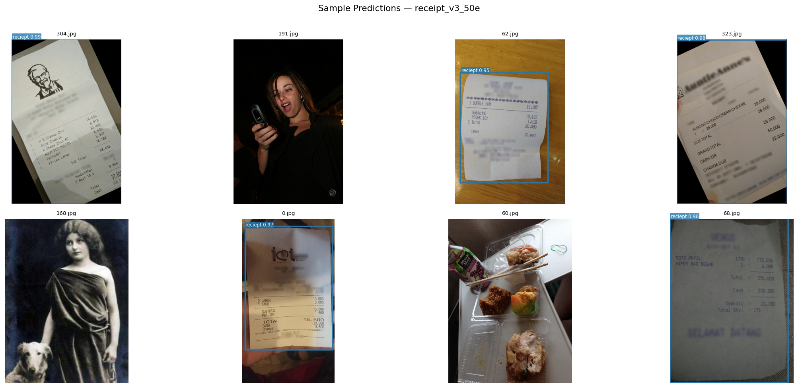

# Receipt Detection System



A production-grade object detection pipeline that localises receipts in arbitrary photographs — from manual dataset labelling to a live AWS deployment with real-time inference via a secured web interface.

## Overview

Given a photo that may or may not contain a receipt, this system draws a tight bounding box around any receipt present. Receipts appear at every angle, under variable lighting, partially obscured, crumpled, or on cluttered surfaces. A purpose-trained YOLO model handles this robustly where general-purpose detectors struggle.

## Results

| Metric | Value |
|---|---|
| mAP@50 | **90.5%** |
| mAP@50–95 | **89.5%** |
| Precision | 88.1% |
| Recall | 96.6% |
| F1 Score | **92.1%** |
| Inference time | ~80–120 ms (CPU, ECS Fargate) |

On 231 validation samples: **199 true positives**, 26 false negatives, 6 false positives.

## Stack

- **Model** — YOLOv8s (Ultralytics), fine-tuned over 50 epochs on a T4 GPU
- **Backend** — FastAPI, Dockerised, running on AWS ECS Fargate
- **Auth** — Amazon Cognito (OAuth 2.0 authorization code flow) + Lambda token proxy
- **API** — AWS API Gateway (Bearer token validation)
- **Frontend** — Static HTML/CSS/JS, hosted on S3 + CloudFront
- **Labelling** — LabelImg (manual YOLO-format annotations)

## Dataset

Two sources were combined to create a balanced, overfitting-resistant dataset:

| Source | Content | Count |
|---|---|---|
| Voxel51 Consolidated Receipt (Hugging Face) | Diverse real-world receipt photos | ~2,200 images |
| COCO 2017 (awsaf49 / Hugging Face) | Hard negatives — non-receipt scenes | 800 images |

**Total: ~3,000 training images.** Split ~90% training / ~10% validation (stratified).

Every receipt image was hand-labelled with LabelImg in YOLO format (`.txt` files with normalised `class cx cy w h`). COCO images receive empty annotation files — an explicit "no objects here" signal to Ultralytics.

## Architecture

The production stack separates concerns across three layers:

```
Browser → CloudFront (S3 static assets)
        → Cognito (OAuth login) → Lambda (token exchange)
        → API Gateway (token validation)
        → ECS Fargate / FastAPI (YOLO inference)
```

1. **Frontend** — CloudFront + S3 serve the static UI. The browser handles image selection, uploads, and bounding box rendering on an HTML Canvas.
2. **Authentication** — Cognito User Pool issues tokens via OAuth 2.0. A Lambda function exchanges the auth code for tokens server-side so the client secret is never exposed in the browser.
3. **API Gateway** — Validates the Bearer token on every request. Unauthenticated requests are rejected before reaching the model container.
4. **Inference** — FastAPI app in Docker on ECS Fargate. Receives the image, runs YOLO, and returns bounding box coordinates and confidence scores as JSON.
5. **Result rendering** — The frontend overlays bounding boxes on the image via HTML Canvas and displays confidence-coded badges.

## Model & Training

- **Architecture** — YOLOv8s (small variant) — chosen for its accuracy/speed tradeoff; fast enough for CPU inference on Fargate, capable enough for the geometric variation in the dataset.
- **Transfer learning** — Fine-tuned from pretrained YOLOv8s weights. The backbone's prior knowledge of edges, textures, and corners accelerates convergence.
- **Augmentation** — Mosaic composition, Mixup, random flipping, HSV colour jitter (built into the Ultralytics pipeline).
- **Hard negatives** — 800 COCO background images suppress false positives; confirmed effective by the very low spurious-fire rate on the validation set.
- **Epochs** — 50
- **Hardware** — NVIDIA T4 GPU

## Key Design Decisions

**Why YOLO small?** Single-class detection with consistent object morphology (rectangular, off-white, text-dense). No need for a large backbone. The small variant delivers real-time inference on CPU-only Fargate containers.

**Why hard negatives?** Without background-only samples, the model risks firing on paper documents, books, or white surfaces. The 800 COCO images make it conservative about non-receipt regions.

**Why a Lambda token proxy?** The OAuth client secret must never appear in frontend JavaScript. The Lambda holds it via environment variables and performs the token exchange server-side — a common mistake avoided.

**Threshold tuning** — Default `conf=0.25` yields recall 96.6% > precision 88.1%. Raising to `conf=0.40–0.45` reduces false positives without retraining.

## What's Next

The receipt detector is the first piece of a larger system. Detected receipts will feed a forthcoming RAG pipeline that extracts line items and enables natural language queries over personal expense history — combined with an agentic layer for autonomous budget analysis.

---

*By [Mahdi Rafiei](https://www.mahdirafiei.co.uk)*
